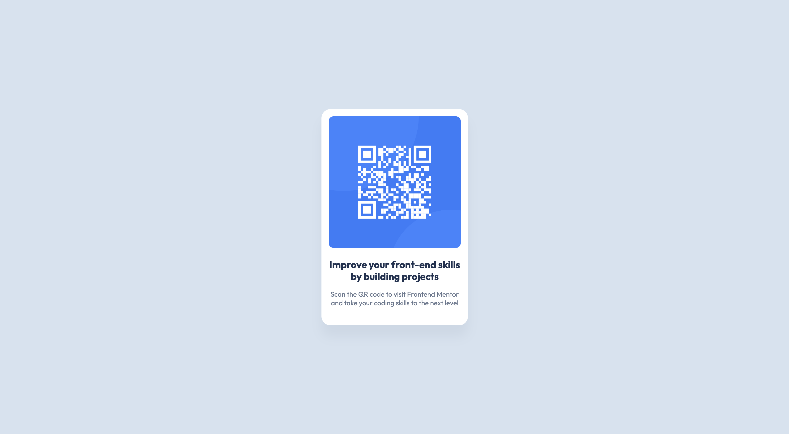

# Frontend Mentor - QR code component solution

This is a solution to the [QR code component challenge on Frontend Mentor](https://www.frontendmentor.io/challenges/qr-code-component-iux_sIO_H). Frontend Mentor challenges help you improve your coding skills by building realistic projects.

## Table of contents

- [Overview](#overview)
  - [Screenshot](#screenshot)
  - [Links](#links)
- [My process](#my-process)
  - [Built with](#built-with)
  - [What I learned](#what-i-learned)
  - [Continued development](#continued-development)
  - [Useful resources](#useful-resources)
- [Author](#author)
- [Acknowledgments](#acknowledgments)

## Overview

### Screenshot



### Links

- Solution URL: [Add solution URL here](https://your-solution-url.com)
- Live Site URL: [Add live site URL here](https://your-live-site-url.com)

## My process

### Built with

- Semantic HTML5 markup
- CSS custom properties
- CSS Grid
- Mobile-first workflow

### What I learned

Through this project, I deepened my knowledge of responsive design. Although I've been learning JavaScript for a while, I realized I had neglected CSS, which is a weak point for me. This challenge was a great opportunity to focus more on CSS fundamentals.

I particularly focused on key techniques for creating fluid layouts. For instance, using `max-width` on the main component allows it to shrink on smaller screens while preventing it from growing too large on bigger ones.

```css
article {
  max-width: 320px;
}
```

Additionally, I learned the importance of making images responsive by setting their width to 100%. This ensures the image scales down to fit its container and never overflows.

```css
img {
  width: 100%;
}
```

### Continued development

My main focus for future development is strengthening my core skills in CSS and responsive design. Although I applied the basics in this project, I want to explore more advanced techniques and become more confident in building complex, adaptive layouts from scratch.

### Useful resources

- [Learn HTML](https://web.dev/learn/html/)
- [Learn CSS](https://web.dev/learn/css/)

## Author

- Github - [Zupi-HR](https://github.com/Zupi-HR)
- Frontend Mentor - [@Zupi-HR](https://www.frontendmentor.io/profile/Zupi-HR)
